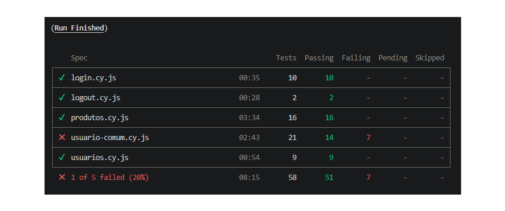

# QA Automation Portfolio - ServeRest


> Projeto de Automação de Testes End-to-End utilizando **Cypress** com foco em boas práticas de Engenharia de Qualidade, documentação técnica, rastreabilidade de requisitos e identificação de defeitos.

---

## Sobre o Projeto

Este projeto foi desenvolvido com o objetivo de simular um ambiente real de trabalho de um **QA Automation Engineer**, contemplando todas as etapas normalmente executadas durante um ciclo de testes:

- Planejamento dos cenários
- Elaboração das matrizes de teste
- Automação E2E
- Identificação de bugs
- Documentação técnica
- Organização do framework
- Geração de evidências

A aplicação utilizada como **Application Under Test (AUT)** é o **ServeRest Front**, um sistema de e-commerce desenvolvido para fins de estudo e prática de testes automatizados.

---

# Objetivos

Este projeto demonstra conhecimentos em:

- Automação de Testes End-to-End
- Testes Funcionais
- Testes Negativos
- Validação de Regras de Negócio
- Controle de Acesso
- Broken Access Control
- Organização de Framework Cypress
- Criação de Massa de Dados Dinâmica
- Reutilização de Código
- Custom Commands
- Integração entre API e UI
- Documentação de Testes
- Reporte de Bugs

---

# Tecnologias Utilizadas

| Tecnologia | Finalidade |
|------------|------------|
| Cypress | Automação E2E |
| JavaScript | Linguagem da automação |
| Node.js | Ambiente de execução |
| NPM | Gerenciamento de dependências |
| Git | Controle de versão |
| GitHub | Hospedagem do projeto |
| Markdown | Documentação |
| ServeRest API | Criação dinâmica da massa de dados |

---

# Arquitetura do Projeto

O framework foi organizado priorizando:

- reutilização de código;
- independência entre cenários;
- baixa manutenção;
- facilidade de evolução;
- legibilidade.

Foram utilizados **Custom Commands**, geração dinâmica de massa de dados via API e separação das responsabilidades entre testes, comandos, fixtures e documentação.

---

---

# 📊 Resultado da Execução da Suíte

A imagem abaixo apresenta o resultado consolidado da execução da suíte automatizada desenvolvida para a aplicação **ServeRest**.

<p align="center">
    
</p>

**Resumo da execução**

| Indicador | Resultado |
|-----------|----------:|
| Total de Casos de Teste | **58** |
| Testes Aprovados | **51** |
| Testes com Falha Esperada | **7** |
| Cobertura | Login, Logout, Produtos, Usuários e Usuário Comum |

> **Observação:** As sete falhas apresentadas pertencem ao módulo **Usuário Comum** e são **intencionais**. Esses testes validam vulnerabilidades reais de controle de acesso (*Broken Access Control*) identificadas na aplicação e documentadas em `docs/bugs/bug-report.md`. Portanto, representam evidências de defeitos da aplicação, e não falhas da automação.

---

# Estrutura do Projeto

```text
qa-automation-portfolio
│
├── cypress
│   ├── e2e
│   │   ├── login.cy.js
│   │   ├── logout.cy.js
│   │   ├── produtos.cy.js
│   │   ├── usuarios.cy.js
│   │   └── usuario-comum.cy.js
│   │
│   ├── fixtures
│   │   ├── produtos.json
│   │   └── usuarios.json
│   │
│   ├── support
│   │   ├── api
│   │   │   ├── auth.js
│   │   │   ├── client.js
│   │   │   ├── config.js
│   │   │   ├── produtos.js
│   │   │   └── usuarios.js
│   │   │
│   │   ├── commands.js
│   │   ├── commands
│   │   └── e2e.js
│   │
│   └── screenshots
│
├── docs
│   ├── bugs
│   │   └── bug-report.md
│   │
│   └── Matrizes
│       ├── matriz-testes-login.md
│       ├── matriz-testes-logout.md
│       ├── matriz-testes-produtos.md
│       ├── matriz-testes-usuarios.md
│       └── matriz-testes-usuario-comum.md
│
├── package.json
├── package-lock.json
├── cypress.config.js
└── README.md
```

---

# Estratégia de Automação

O framework foi construído utilizando uma abordagem híbrida entre **UI** e **API**.

Sempre que possível, a preparação da massa de dados ocorre via API, reduzindo o tempo de execução dos testes e eliminando dependência da interface para criação de usuários e produtos.

Essa estratégia proporciona:

- maior estabilidade;
- menor tempo de execução;
- isolamento entre cenários;
- independência dos testes;
- redução de flakiness.

As validações funcionais permanecem sendo realizadas integralmente pela interface gráfica da aplicação.

---

# Boas Práticas Aplicadas

Durante o desenvolvimento do framework foram adotadas as seguintes práticas:

- Independência entre cenários.
- Massa de dados dinâmica.
- Dados únicos utilizando timestamp.
- Reutilização através de Custom Commands.
- Separação entre preparação e validação dos testes.
- Comentários técnicos objetivos.
- Organização modular do framework.
- Padronização dos nomes dos casos de teste (CT).
- Rastreabilidade entre requisitos, automação e documentação.
- Documentação completa dos defeitos encontrados.

# Pré-requisitos

Antes de executar a suíte automatizada, certifique-se de possuir as seguintes ferramentas instaladas:

| Ferramenta | Versão Recomendada |
|------------|-------------------|
| Node.js | 18 ou superior |
| npm | 9 ou superior |
| Git | Última versão |
| Visual Studio Code | Opcional |
| Google Chrome | Última versão |

---

# Clonando o Projeto

Clone o repositório para sua máquina.

```bash
git clone https://github.com/SEU-USUARIO/qa-automation-portfolio.git
```

Entre na pasta do projeto.

```bash
cd qa-automation-portfolio
```

---

# Instalando as Dependências

Execute:

```bash
npm install
```

O comando instalará todas as dependências utilizadas pelo framework Cypress.

---

# Executando os Testes

## Abrindo o Cypress

```bash
npx cypress open
```

O Cypress abrirá a interface gráfica permitindo executar qualquer suíte individualmente.

---

## Execução Headless

Para executar todos os testes:

```bash
npx cypress run
```

---

## Executar um Arquivo Específico

### Login

```bash
npx cypress run --spec "cypress/e2e/login.cy.js"
```

### Logout

```bash
npx cypress run --spec "cypress/e2e/logout.cy.js"
```

### Produtos

```bash
npx cypress run --spec "cypress/e2e/produtos.cy.js"
```

### Usuários

```bash
npx cypress run --spec "cypress/e2e/usuarios.cy.js"
```

### Usuário Comum

```bash
npx cypress run --spec "cypress/e2e/usuario-comum.cy.js"
```

---

# Organização da Suíte Automatizada

A automação foi dividida em cinco módulos independentes.

| Módulo | Objetivo |
|--------|----------|
| Login | Validação completa da autenticação |
| Logout | Encerramento da sessão |
| Produtos | Cadastro, validações e exclusão de produtos |
| Usuários | Cadastro e regras administrativas |
| Usuário Comum | Funcionalidades disponíveis ao cliente e controle de acesso |

Cada módulo possui sua própria documentação, matriz de testes e cobertura funcional.

---

# Casos Automatizados

## Login

| Categoria | Quantidade |
|-----------|-----------:|
| Casos Automatizados | 10 |
| Casos Bloqueados | 0 |
| Casos Não Executados | 0 |

---

## Logout

| Categoria | Quantidade |
|-----------|-----------:|
| Casos Automatizados | 2 |
| Casos Bloqueados | 0 |
| Casos Não Executados | 0 |

---

## Produtos

| Categoria | Quantidade |
|-----------|-----------:|
| Casos Automatizados | 16 |
| Casos Bloqueados | 2 |
| Casos Não Executados | 2 |

---

## Usuários

| Categoria | Quantidade |
|-----------|-----------:|
| Casos Automatizados | 9 |
| Casos Bloqueados | 3 |

---

## Usuário Comum

| Categoria | Quantidade |
|-----------|-----------:|
| Casos Automatizados | 21 |
| Casos de Segurança | 8 |

---

# Estatísticas Gerais

| Indicador | Quantidade |
|-----------|-----------:|
| Suítes Automatizadas | 5 |
| Casos Automatizados | 58 |
| Casos Bloqueados | 5 |
| Casos Não Executados | 2 |

---

# Estratégia de Massa de Dados

A maior parte da preparação da massa de dados é realizada via **API**, permitindo que os cenários sejam independentes e executados repetidamente sem dependência de registros previamente existentes.

Foram implementadas estratégias como:

- criação dinâmica de administradores;
- criação dinâmica de usuários comuns;
- criação dinâmica de produtos;
- geração de e-mails únicos utilizando timestamp;
- isolamento entre cenários;
- reutilização por meio de **Custom Commands**.

Essa abordagem reduz o tempo de execução da suíte e diminui a ocorrência de falhas intermitentes (flaky tests), além de tornar os testes mais previsíveis e fáceis de manter.

# Cobertura Funcional

A suíte automatizada contempla os principais fluxos da aplicação **ServeRest**, abrangendo cenários positivos, negativos, regras de negócio e validações de segurança.

---

## Login

### Funcionalidades

- Login com credenciais válidas
- Validação de senha inválida
- Validação de e-mail inválido
- Validação de credenciais inválidas
- Campos obrigatórios
- Validação do formato do e-mail
- Logout
- Proteção de rotas autenticadas

---

## Logout

### Funcionalidades

- Encerramento da sessão
- Redirecionamento para Login
- Invalidação da sessão
- Bloqueio de acesso às áreas administrativas

---

## Produtos

### Funcionalidades

- Cadastro de produto
- Cadastro sem imagem
- Validação de campos obrigatórios
- Validação de preço
- Validação de quantidade
- Caracteres especiais
- Descrição extensa
- Exclusão
- Persistência na listagem
- Controle de acesso sem autenticação

---

## Usuários

### Funcionalidades

- Cadastro de usuário comum
- Cadastro de administrador
- Validação de campos obrigatórios
- Validação de e-mail duplicado
- Validação do formato do e-mail
- Regra de exclusão do próprio usuário

---

## Usuário Comum

### Funcionalidades

- Login
- Logout
- Pesquisa de produtos
- Lista de compras
- Carrinho
- Controle de quantidade
- Controle de acesso
- Testes de Broken Access Control

---

# Estratégia de Testes

A automação foi construída priorizando cenários que representassem o comportamento esperado da aplicação sob diferentes perspectivas.

Foram implementados testes para:

- Fluxos positivos
- Fluxos negativos
- Regras de negócio
- Validação de campos obrigatórios
- Controle de acesso
- Testes exploratórios automatizados
- Validações de segurança
- Persistência dos dados
- Isolamento da massa de testes

---

# Documentação do Projeto

Toda a documentação foi produzida em Markdown e organizada na pasta **docs**, permitindo rastreabilidade entre requisitos, automação e defeitos encontrados.

```
docs/
│
├── bugs
│   └── bug-report.md
│
└── Matrizes
    ├── matriz-testes-login.md
    ├── matriz-testes-logout.md
    ├── matriz-testes-produtos.md
    ├── matriz-testes-usuarios.md
    └── matriz-testes-usuario-comum.md
```

Cada documento possui um objetivo específico:

| Documento | Descrição |
|------------|-----------|
| Bug Report | Registro detalhado dos defeitos encontrados durante os testes. |
| Matriz de Login | Casos de teste do módulo Login. |
| Matriz de Logout | Casos de teste do módulo Logout. |
| Matriz de Produtos | Casos de teste do módulo Produtos. |
| Matriz de Usuários | Casos de teste do módulo Usuários. |
| Matriz de Usuário Comum | Casos de teste relacionados ao perfil de usuário comum e controle de acesso. |

---

# Bugs Encontrados

Durante a execução da suíte automatizada foram identificados **6 defeitos confirmados**, classificados entre falhas funcionais e vulnerabilidades de controle de acesso.

## Resumo

| ID | Categoria | Severidade |
|----|-----------|------------|
| BUG-001 | Funcional | Alta |
| BUG-002 | Funcional | Alta |
| BUG-003 | Segurança (Broken Access Control) | Crítica |
| BUG-004 | Segurança (Broken Access Control) | Crítica |
| BUG-005 | Funcional | Média |
| BUG-006 | Segurança (Broken Access Control) | Crítica |

Todos os defeitos encontram-se documentados no arquivo:

```
docs/bugs/bug-report.md
```

---

# Evidências

Durante a execução dos testes foram coletadas evidências para validação dos cenários automatizados.

As evidências incluem:

- Execução da suíte pelo Cypress Runner;
- Capturas de tela dos comportamentos observados;
- Validação dos defeitos encontrados;
- Registros das execuções automatizadas.

As imagens podem ser encontradas em:

```
cypress/screenshots
```

---

# Boas Práticas Aplicadas

Durante o desenvolvimento do framework foram adotadas práticas voltadas para manutenção, reutilização e escalabilidade da automação.

Entre elas destacam-se:

- Massa de dados dinâmica via API;
- Independência entre cenários;
- Reutilização através de Custom Commands;
- Geração de e-mails únicos utilizando timestamp;
- Separação entre preparação e validação dos testes;
- Organização modular da suíte;
- Comentários técnicos padronizados;
- Padronização dos IDs dos casos de teste;
- Documentação sincronizada com a automação;
- Rastreabilidade entre casos de teste, bugs e funcionalidades.

---

# Diferenciais do Projeto

Este projeto foi desenvolvido buscando simular um ambiente profissional de Engenharia de Qualidade.

Alguns diferenciais implementados:

- Framework organizado por responsabilidade;
- Integração entre API e UI;
- Preparação automática da massa de dados;
- Documentação técnica completa;
- Matrizes de teste para todos os módulos;
- Relatório de bugs estruturado;
- Casos de teste independentes;
- Cobertura de testes de segurança (Broken Access Control);
- Estrutura preparada para evolução com CI/CD.

# Roadmap

Embora o framework esteja funcional e documentado, existem oportunidades de evolução para torná-lo ainda mais robusto.

## Melhorias Planejadas

### Curto Prazo

- Inclusão de relatórios HTML utilizando Mochawesome.
- Geração automática de evidências ao final da execução.
- Execução automática em ambiente Linux.

---

### Médio Prazo

- Integração com GitHub Actions.
- Execução automática a cada Push.
- Execução automática a cada Pull Request.
- Publicação automática dos relatórios.

---

### Longo Prazo

- Dockerização do projeto.
- Integração com Allure Report.
- Execução Cross Browser.
- Pipeline completo de CI/CD.
- Integração com SonarQube.

---

# Padrões Utilizados

Durante o desenvolvimento deste framework foram adotados padrões que priorizam legibilidade, reutilização e facilidade de manutenção.

## Organização

- Estrutura modular.
- Separação por responsabilidade.
- Comentários técnicos objetivos.
- Padronização de nomenclatura.

---

## Automação

- Custom Commands.
- Massa de dados dinâmica.
- Geração automática de usuários.
- Geração automática de produtos.
- Testes independentes.

---

## Documentação

- Matrizes de Teste.
- Bug Report.
- README técnico.
- Rastreabilidade entre testes e defeitos.

---

# Contribuição

Contribuições são bem-vindas.

Caso identifique melhorias, correções ou novas oportunidades de automação, fique à vontade para abrir uma Issue ou enviar um Pull Request.

Fluxo recomendado:

1. Faça um Fork do projeto.
2. Crie uma nova Branch.
3. Implemente a melhoria.
4. Execute toda a suíte automatizada.
5. Atualize a documentação, caso necessário.
6. Abra um Pull Request.

Sempre que possível, novas funcionalidades devem ser acompanhadas de novos casos de teste e documentação correspondente.

---

# Lições Aprendidas

Durante o desenvolvimento deste projeto foram praticados conceitos importantes de Engenharia de Qualidade, entre eles:

- Planejamento de testes.
- Escrita de casos de teste.
- Organização de Framework Cypress.
- Criação de massa de dados via API.
- Automação End-to-End.
- Reutilização de código.
- Identificação de defeitos.
- Documentação de bugs.
- Controle de acesso (Broken Access Control).
- Boas práticas de documentação técnica.

---

# Resultados Obtidos

Ao final do projeto foi possível alcançar os seguintes resultados:

| Indicador | Resultado |
|-----------|----------:|
| Módulos Automatizados | 5 |
| Casos Automatizados | 58 |
| Bugs Confirmados | 6 |
| Vulnerabilidades de Segurança | 3 |
| Matrizes de Teste | 5 |
| Relatórios de Bugs | 1 |

---

# Autor

**Eduardo Rodrigues**

QA Automation Engineer

Projeto desenvolvido para fins de estudo, prática de automação de testes e composição de portfólio profissional.

GitHub:

```text
https://github.com/SEU-USUARIO
```

LinkedIn:

```text
https://www.linkedin.com/in/SEU-LINKEDIN
```

---

# Licença

Este projeto possui finalidade exclusivamente educacional e de demonstração técnica.

A aplicação **ServeRest** utilizada como alvo dos testes pertence aos seus respectivos mantenedores e foi utilizada apenas para fins de estudo.

O código deste framework pode ser reutilizado para fins acadêmicos e de aprendizado, respeitando as licenças dos projetos de terceiros utilizados como dependência.

---

# Considerações Finais

Este projeto foi desenvolvido buscando reproduzir práticas utilizadas em ambientes reais de Engenharia de Qualidade, contemplando não apenas a automação de testes, mas também planejamento, documentação, rastreabilidade e identificação de defeitos.

Além da implementação da suíte automatizada, foram produzidos artefatos que normalmente fazem parte do ciclo de testes em equipes de QA, como matrizes de casos de teste, relatório de bugs e documentação técnica.

O resultado é um framework organizado, modular e de fácil manutenção, preparado para evolução contínua e para integração com pipelines de Integração Contínua (CI/CD).

---

## Obrigado por visitar este projeto!

Caso tenha sugestões de melhoria ou queira trocar experiências sobre QA Automation, fique à vontade para entrar em contato.